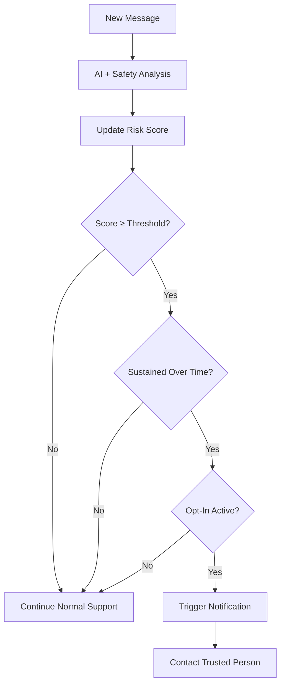

# AXV Digital Safety Net — Architecture Overview (Fixed v0.2)

This document outlines a **high-level architecture** for the AXV Digital Safety Net (DSN).  
It is conceptual and intended for discussion and refinement.

---

## 1. High-Level Flow

```mermaid
flowchart LR
    U[User] -->|Converses| AI[AI Assistant (Sentinel Mode)]
    AI --> RDE[Risk Detection Engine (RDE)]
    RDE -->|Risk Score + Patterns| DEC{Meets Crisis Threshold?}
    DEC -->|No| END[No Notification / Standard Support]
    DEC -->|Yes & Opt-In Active| NOTIF[Notification Module]
    NOTIF --> C[Trusted Contact (Family / Friend / Therapist)]
```

**Text fallback (GitHub Pages):**

User → AI Assistant (Sentinel Mode)  
AI → Risk Detection Engine  
RDE → If risk below threshold → Standard support  
RDE → If above threshold + opt-in active → Notify Trusted Contact  

---

## 2. Components

### 2.1 AI Assistant (Sentinel Mode)
- Provides normal conversational assistance.  
- Runs crisis-detection layers in parallel.  
- Produces semantic signals:
  - direct risk,
  - indirect emotional risk,
  - pattern risk over time.

### 2.2 Risk Detection Engine (RDE)
Evaluates:
- **HRD** — High-Risk Direct  
- **MRI** — Medium-Risk Indirect  
- **PRM** — Pattern Risk Modeling  

Outputs a continuous **Risk Score (0–100)**.

### 2.3 Opt-In State
Stores:
- user opt-in,  
- trusted contacts,  
- preferences.  

### 2.4 Notification Module
- Sends minimal alerts.  
- No chat content.  
- No location.  
- No automatic contact with authorities.

---

## 3. Opt-In / Opt-Out Flow

```mermaid
flowchart TD
    START[Start] --> Q1{Enable Digital Safety Net?}
    Q1 -->|No| OUT1[Standard AI Mode (No DSN)]
    Q1 -->|Yes| CONTACTS[Select 1–3 Trusted Contacts]
    CONTACTS --> RULES[Review and Accept DSN Rules]
    RULES --> ACTIVE[Digital Sentinel Mode Active]
    ACTIVE -->|User Disables DSN| OUT2[DSN Deactivated]
```

**Text fallback (GitHub Pages):**

Start → Enable DSN?  
- No → Standard AI mode  
- Yes → Select contacts → Accept rules → DSN active  
Disable at any time → DSN deactivated  

---

## 4. Escalation Logic



**Text fallback (GitHub Pages):**

New message → Safety analysis → Risk score updated  
If score < threshold → no escalation  
If score ≥ threshold but not sustained → no escalation  
If sustained + opt-in active → notify trusted contact  

---

## 5. Data & Privacy Principles

- No conversation content stored or shared.  
- Minimal notification template only.  
- Opt-in fully reversible.  
- No automatic contact with emergency services.  

---

## 6. Future Extensions

- NGO integration  
- On-device DSN  
- Federated risk model  
- UX flows for notifications  
- Clinical review + PHQA testing  

---

End of document.
