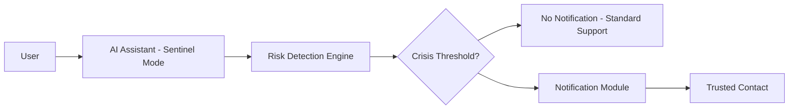
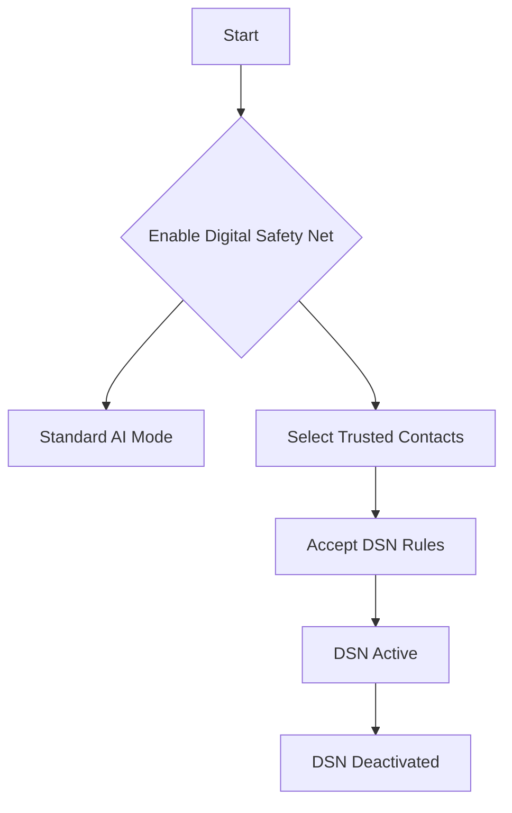
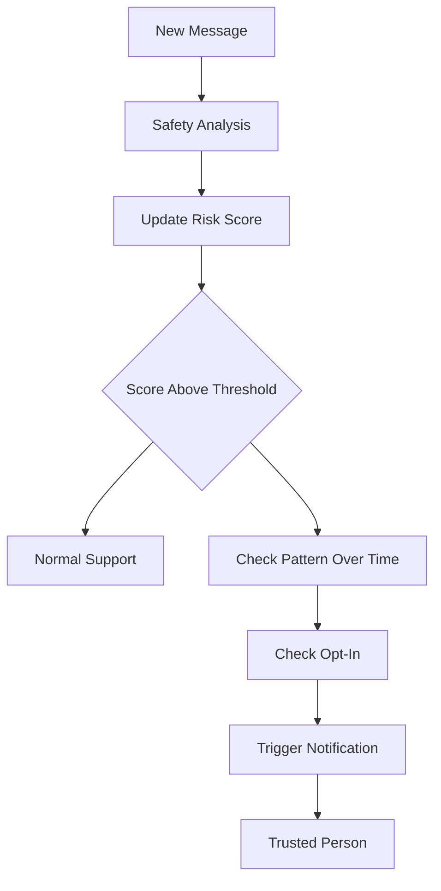

# AXV Digital Safety Net — Architecture Overview (Safe Mermaid v0.2)

This document outlines a **high-level architecture** for the AXV Digital Safety Net (DSN).  
It is conceptual and intended for discussion and refinement.

---

## 1. High-Level Flow

**Text fallback:**

User → AI Assistant (Sentinel Mode) → Risk Detection Engine  
If no crisis threshold → No notification / standard support  
If crisis threshold and DSN active → Notification module → Trusted contact  

---

## 2. Components

### 2.1 AI Assistant (Sentinel Mode)
- Provides normal conversational assistance.  
- Runs crisis-detection layers in parallel.  
- Produces semantic signals about risk and emotional state.

### 2.2 Risk Detection Engine (RDE)
- Evaluates:
  - high-risk direct statements,
  - indirect risk signals,
  - patterns over time.
- Outputs a continuous **Risk Score (0–100)**.

### 2.3 Opt-In State
- Stores:
  - user opt-in status,
  - trusted contacts,
  - preferences.

### 2.4 Notification Module
- Sends minimal alerts.  
- No chat content.  
- No location.  
- No automatic contact with authorities.

---

## 3. Opt-In / Opt-Out Flow

**Text fallback:**

Start → decision "Enable Digital Safety Net"  
- If no → Standard AI mode  
- If yes → Select contacts → Accept rules → DSN active  
User can deactivate DSN at any time.  

---

## 4. Escalation Logic

**Text fallback:**

New message → Safety analysis → Risk score update  
If below threshold → normal support  
If above threshold and pattern sustained and user opted-in → notification to trusted person  

---

## 5. Data and Privacy Principles

- No conversation content stored or shared.  
- Minimal notification text only.  
- Opt-in is fully reversible.  
- No automatic contact with emergency services.  

---

## 6. Future Extensions

- NGO integration  
- On-device DSN  
- Federated risk models  
- UX flows for notifications  
- Clinical review and PHQA testing  

---

End of document.
