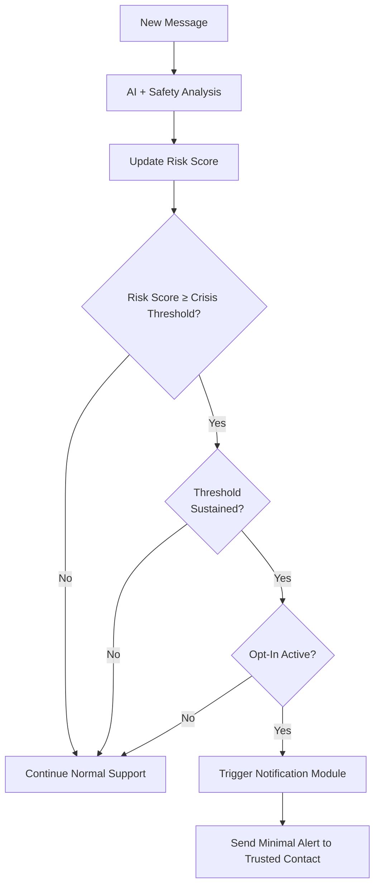

# AXV Digital Safety Net — Architecture Overview (Draft v0.2)

This document outlines a **high-level architecture** for the AXV Digital Safety Net (DSN).  
It is conceptual and intended for discussion and refinement.

---

## 1. High-Level Flow

```md
```mermaid
flowchart LR
    U[User] -->|Converses| AI[AI Assistant (Sentinel Mode)]
    AI --> RDE[Risk Detection Engine (RDE)]
    RDE -->|Risk Score + Patterns| DEC{Meets Crisis Threshold?}
    DEC -->|No| END[No Notification / Standard Support]
    DEC -->|Yes & Opt-In Active| NOTIF[Notification Module]
    NOTIF --> C[Trusted Contact (Family / Friend / Therapist)]

```

**Key idea:**  
AI remains a **supportive assistant**.  
The **Risk Detection Engine** is a background safety layer.  
Only when the user has explicitly opted in *and* the risk is critical and sustained, a notification may be sent to a Trusted Contact.

---

## 2. Components

### 2.1 AI Assistant (Sentinel Mode)
- Provides normal conversational assistance.
- Runs safety and crisis-detection layers in parallel.
- Produces semantic signals:
  - detected intent (help-seeking, role-play, self-harm, etc.),
  - emotional tone (despair, hopelessness),
  - contextual markers (first-time mention vs repeated patterns).

### 2.2 Risk Detection Engine (RDE)
- Consumes semantic signals from the assistant.
- Evaluates three categories:
  - **High-Risk Direct (HRD)** — explicit self-harm statements.
  - **Medium-Risk Indirect (MRI)** — indirect but concerning language.
  - **Pattern-Risk Modeling (PRM)** — aggregated risk over time.
- Outputs:
  - a continuous **Risk Score (0–100)**,
  - optional flags (e.g. `RISK_TREND_UP`, `NO_DE-ESCALATION`).

### 2.3 Opt-In State
- Separate secure storage for:
  - opt-in status,
  - list of Trusted Contacts,
  - user-level preferences (e.g. minimal vs confirmed notification).
- DSN logic must **always** check this state before any escalation.

### 2.4 Notification Module
- Encapsulates all outbound channels (SMS, email, push).
- Ensures:
  - no conversation content is included,
  - no geolocation is attached,
  - no direct contact with authorities is performed.
- Sends only minimal, user-approved templates.

---

## 3. Opt-In / Opt-Out Flow


```mermaid
flowchart TD
    START[Start] --> Q1{Enable Digital Safety Net?}
    Q1 -->|No| OUT1[Standard AI Mode (No DSN)]
    Q1 -->|Yes| CONTACTS[Select 1–3 Trusted Contacts]
    CONTACTS --> RULES[Review and Accept DSN Rules]
    RULES --> ACTIVE[Digital Sentinel Mode Active]
    ACTIVE -->|User Disables DSN| OUT2[DSN Deactivated]
```

**Rules presented to the user:**
- DSN may notify a Trusted Contact in critical situations.
- No chat content is ever shared.
- No police or emergency services are contacted automatically.
- User can disable DSN at any time.

---

## 4. Escalation Logic (Conceptual)



Criteria such as **“sustained threshold”** and **pattern-based confirmation** are essential to avoid:
- false positives,
- accidental escalation during role-play or testing,
- over-triggering in highly emotional but non-critical situations.

---

## 5. Data & Privacy Considerations

- **No conversation logs are required** for notification.
- Risk computation can be done on transient data.
- Notification payload must be strictly minimal:
  - identity/handle of user (if needed),
  - pre-agreed template text only.
- Trusted Contacts are stored in a dedicated, secure configuration store.

---

## 6. Future Extensions (Beyond v0.2)

Potential future architecture features:

- **NGO Integration Layer**
  - routing select alerts to trained crisis responders (with user consent).
- **Local-Only Modes**
  - DSN running in fully local environments (on-device, on-premise).
- **Federated Risk Models**
  - learning from anonymized, aggregated patterns without centralizing raw text.

---

This architecture is a **starting point**, not a final blueprint.  
It is intentionally conservative, prioritizing **consent, privacy, and human agency** over automation.
